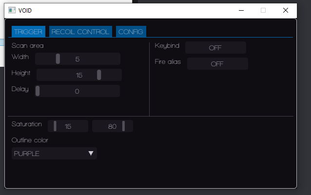

# VALORANT  
**Undetected external** cheat using HSV color detection.  
This will not mess with the addresses and memories of the game, it's 100% memory independent.  
  
Customizable via menu.  
- Panic key is 'Del', press it to exit the cheat.  
  
    
 
# INFO    
- Change the saturation if it's shoting poorly or not shoting.  
The default saturation is 15 - 80 (Min - Max)       
Select a 'Keybind' and alias it to Valorant as a seconday fire key.   
1) In the game goto settings, find something like Keyboard or Keybinds. 
2) Find the Fire/Shoot Option:
    - by default the primary key is the left mouse button
    - the secondary it's not assigned (Bind it to any key, like 'K' ).
3) Go back to the software click once in 'Fire Alias' and then hit the same key, in this case 'K'.
4) According to Trigger source code, Keybind is a key that has to be pressed while you want to use the triggerbot (Do not bind the same as Fire Alias).

# WARNING  
This project won't be continued.  
I've not tested the cheat since 'first commit' release date.  
